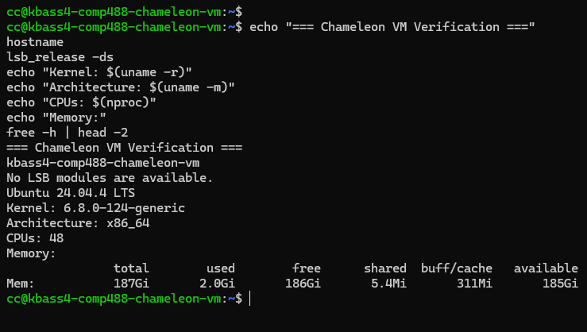

# Chameleon Cloud Virtual Machine Documentation

## Overview

A single Ubuntu 24.04 virtual machine was created on Chameleon Cloud using the CHI@UC site. The experiment was intentionally kept brief and used a one-hour resource lease.

The following steps were completed:

* Chameleon Cloud portal exploration
* Time zone configuration
* SSH key configuration
* Ubuntu 24.04 image identification
* Compute flavor inspection
* One-hour host reservation
* Ubuntu 24.04 VM launch
* Floating IP association
* SSH login
* System verification
* Terminal screenshot capture
* Resource cleanup and release

## 1. Chameleon Cloud Site Details

The experiment used the following project allocation and site configuration:

* **Site:** CHI@UC
* **Project:** cloudmesh
* **Project Allocation:** CH-817419
* **Time Zone:** US/Central
* **Ubuntu Image:** CC-Ubuntu24.04
* **Image Size:** 1.55 GB
* **Image Format:** QCOW2
* **Image Visibility:** Public

The Chameleon portal was explored before resource allocation, including the project dashboard, key-pair management, instances, images, leases, networking, and compute resources.

## 2. SSH Key Setup

An SSH key pair was generated through Chameleon Cloud and the private key was downloaded locally.

The downloaded private key was saved to:

```text
~/.ssh/kbass4-comp488-chameleon.pem
```

The private-key permissions were secured using:

```bash
chmod 600 ~/.ssh/kbass4-comp488-chameleon.pem
```

The resulting file permissions were verified as:

```text
-rw------- 1 kbass4 kbass4 1679 /home/kbass4/.ssh/kbass4-comp488-chameleon.pem
```

The corresponding Chameleon key pair name registered in the portal was:

`kbass4-comp488-chameleon`

## 3. Ubuntu 24.04 Image and Flavor

The available images and flavor options were inspected in the CHI@UC portal prior to launching the VM.

* **Selected Image:** `CC-Ubuntu24.04`
* **Selected Flavor:** `baremetal`

The CHI@UC flavor selection showed only `baremetal` for the selected Ubuntu 24.04 image. No smaller or alternative flavors were displayed by the Chameleon interface for this site and image combination. Therefore, `baremetal` was selected as the actual available flavor rather than assuming or inventing another instance size.

## 4. Resource Lease Configuration

A one-hour lease was created before launching the VM, as required by the assignment.

| Setting | Value |
| :--- | :--- |
| **Site** | CHI@UC |
| **Start Time** | 12:30 |
| **End Time** | 13:30 |
| **Lease Length** | 0 days |
| **Minimum Hosts** | 1 |
| **Maximum Hosts** | 1 |
| **Resource Criteria** | None |
| **Reserve Hosts** | Yes |
| **Reserve Network** | No |

The lease initially entered a `PENDING` state and subsequently became `ACTIVE`. The VM was launched after the lease became active.

## 5. VM Configuration

The resulting virtual machine configuration details are listed below:

| Property | Value |
| :--- | :--- |
| **Instance Name** | kbass4-comp488-chameleon-vm |
| **Image** | CC-Ubuntu24.04 |
| **Flavor** | baremetal |
| **SSH Key** | kbass4-comp488-chameleon |
| **Status** | Running |
| **Private IP** | 10.140.82.108 |
| **Floating IP** | 192.5.87.52 |

The VM was connected to `sharednet1`. A floating IP address (`192.5.87.52`) was assigned to provide external SSH access.

## 6. SSH Connection & Terminal Login

The VM was accessed from WSL Ubuntu using the private key downloaded from Chameleon Cloud:

```bash
ssh -i ~/.ssh/kbass4-comp488-chameleon.pem cc@192.5.87.52
```

The SSH host acceptance prompt and successful initial connection to the remote terminal prompt are shown below:

```text
kbass4@BASSKhalidou:~$ ssh -i ~/.ssh/kbass4-comp488-chameleon.pem cc@192.5.87.52
The authenticity of host '192.5.87.52 (192.5.87.52)' can't be established.
ED25519 key fingerprint is: SHA256:lk0NHRCsR5nkc+Qu3l9wyGz7S18EJQyhTl0EINObPP0
This key is not known by any other names.
Are you sure you want to continue connecting (yes/no/[fingerprint])? yes
Warning: Permanently added '192.5.87.52' (ED25519) to the list of known hosts.
Welcome to Ubuntu 24.04.4 LTS (GNU/Linux 6.8.0-124-generic x86_64)
[...]
cc@kbass4-comp488-chameleon-vm:~$
```

The successful shell prompt (`cc@kbass4-comp488-chameleon-vm:~$`) confirms that remote SSH access to the Ubuntu 24.04 VM was established.

## 7. System Verification

After connecting to the VM, several verification commands were run to inspect the operating system, kernel, CPU, memory, and network configuration.

### Hostname Verification

```bash
hostname
```

**Output:**

```text
kbass4-comp488-chameleon-vm
```

### OS Distribution & Release

```bash
lsb_release -a
```

**Output:**

```text
No LSB modules are available.
Distributor ID: Ubuntu
Description:    Ubuntu 24.04.4 LTS
Release:        24.04
Codename:       noble
```

### Kernel Version & Architecture

```bash
uname -a
```

**Output:**

```text
Linux kbass4-comp488-chameleon-vm 6.8.0-124-generic #124-Ubuntu SMP PREEMPT_DYNAMIC Tue May 26 13:00:45 UTC 2026 x86_64 x86_64 x86_64 GNU/Linux
```

### Available CPU Cores

```bash
nproc
```

**Output:**

```text
48
```

### Memory & Swap Allocation

```bash
free -h
```

**Output:**

```text
               total        used        free      shared  buff/cache   available
Mem:           187Gi       2.0Gi       186Gi       5.4Mi       311Mi       185Gi
Swap:             0B          0B          0B
```

### Network Interfaces

```bash
ip addr
```

The VM displayed the `eno1np0` network interface as active.

### Verification Summary

* **OS Version:** Ubuntu 24.04.4 LTS (Codename: Noble)
* **Linux Kernel:** 6.8.0-124-generic (x86_64 architecture)
* **Hardware Resources:** 48 CPUs, 187 GiB RAM, 0 B swap
* **Network Connectivity:** SSH access verified via floating IP `192.5.87.52`

## 8. Terminal Screenshot Verification

Below is the verification screenshot documenting the active terminal session on the Chameleon Cloud VM:



## 9. Cleanup and Resource Release

After the VM verification and screenshot were completed, the Chameleon resources were released.

The following cleanup actions were completed:

* The `kbass4-comp488-chameleon-vm` instance was deleted.
* The floating IP `192.5.87.52` was released.
* The active host lease was released.
* No Chameleon compute resources remained allocated after the experiment.

The cleanup completed the experiment within the requested short-duration resource allocation and returned the Chameleon resources for other users.

## Conclusion

The Chameleon Cloud virtual machine setup was completed successfully on the CHI@UC site. By reserving a host lease, provisioning an Ubuntu 24.04 image, and associating a floating IP, secure SSH access was established using a dedicated key pair. System inspection confirmed that all hardware and software specifications matched expectations before all resources were systematically decommissioned and released.