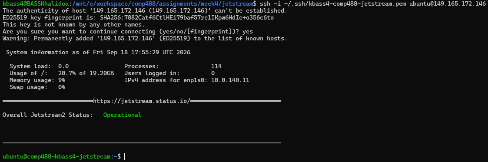
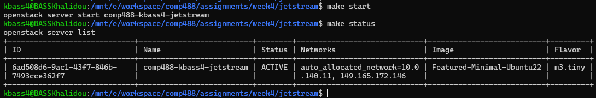
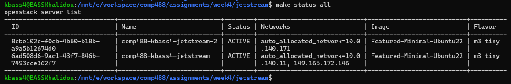
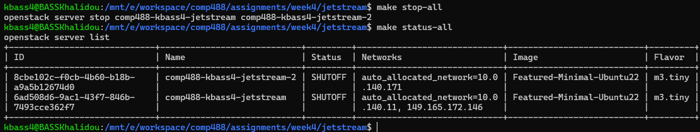

# Week 4 – Jetstream 2 VM Management with Makefile

## Overview

Jetstream 2 was used to create and manage Ubuntu virtual machines through the OpenStack command-line interface. A Makefile was created to automate common VM lifecycle operations, including creation, startup, shutdown, status inspection, floating IP management, deletion, and management of multiple virtual machines.

The implementation demonstrates how OpenStack commands can be organized through Make targets to provide a simple and repeatable method for managing cloud virtual machines.

---

## OpenStack CLI Setup

The OpenStack command-line client was installed inside WSL:

```bash
sudo apt update
sudo apt install -y python3-openstackclient
```

The installation was verified with:

```bash
openstack --version
```

The installed version was:

```text
openstack 9.0.0
```

---

## Jetstream Authentication

Authentication was configured using an OpenStack application credential.

An application credential was created through the Jetstream 2 OpenStack interface under:

```text
Identity → Application Credentials
```

The generated `clouds.yaml` file was copied to the standard OpenStack configuration directory:

```bash
mkdir -p ~/.config/openstack
cp "/mnt/c/users/User NA/Downloads/clouds.yaml" ~/.config/openstack/clouds.yaml
```

The permissions of the configuration file were restricted:

```bash
chmod 600 ~/.config/openstack/clouds.yaml
```

The resulting file was located at:

```text
~/.config/openstack/clouds.yaml
```

Authentication was successfully verified using:

```bash
openstack token issue
```

This configuration allows the OpenStack CLI to authenticate with Jetstream without storing credentials inside the assignment repository.

---

## Jetstream Resource Selection

Available OpenStack resources were inspected before creating the virtual machine.

The following configuration was selected:

| Resource | Configuration |
|---|---|
| VM name | `comp488-kbass4-jetstream` |
| Image | `Featured-Minimal-Ubuntu22` |
| Flavor | `m3.tiny` |
| Network | `auto_allocated_network` |
| Security group | `remotelogin` |
| Key pair | `kbass4-comp488-jetstream` |
| SSH username | `ubuntu` |

The `m3.tiny` flavor provided one virtual CPU, approximately 3 GB of memory, and a 20 GB disk.

---

## Makefile

A Makefile was created at:

```text
assignments/week4/jetstream/Makefile
```

The Makefile provides targets for managing the Jetstream virtual machine.

The primary VM lifecycle targets include:

```bash
make create
make start
make stop
make status
make info
make delete
make attach-ip
make detach-ip
```

The Makefile was later extended with targets for managing multiple virtual machines:

```bash
make create-second
make start-all
make stop-all
make status-all
make delete-second
```

The available commands can be displayed using:

```bash
make help
```

Example output:

```text
COMP 488 - Jetstream 2 VM Management
-------------------------------------
make create  - Create the VM
make start   - Start the VM
make stop    - Stop the VM
make status  - List VMs
make info    - Show VM information
make delete  - Delete the VM
make attach-ip - Attach floating IP to the VM
make detach-ip - Detach floating IP from the VM

Multiple VMs:
make create-second - Create the second VM
make start-all     - Start both VMs
make stop-all      - Stop both VMs
make status-all    - List all VMs
make delete-second - Delete the second VM
```

This provides a simple interface for executing common OpenStack operations without repeatedly entering the complete OpenStack commands.

---

## Creating the Virtual Machine

The primary Jetstream VM was created through the Makefile:

```bash
make create
```

The Makefile used the selected image, flavor, network, security group, and SSH key to create:

```text
comp488-kbass4-jetstream
```

The instance configuration was inspected using:

```bash
make info
```

After the build process completed, the VM reached the `ACTIVE` state.

The private IP assigned to the VM was:

```text
10.0.140.11
```

The instance used:

```text
Image:          Featured-Minimal-Ubuntu22
Flavor:         m3.tiny
Network:        auto_allocated_network
Security Group: remotelogin
Key Pair:       kbass4-comp488-jetstream
```

---

## Floating IP Configuration

The VM initially had only its private address. A floating IP was therefore allocated from the Jetstream public network:

```bash
openstack floating ip create public
```

The allocated floating IP was:

```text
149.165.172.146
```

The Makefile was configured with this address and used to associate it with the VM:

```bash
make attach-ip
```

The VM status was then checked:

```bash
make status
```

The instance showed both addresses:

```text
auto_allocated_network=10.0.140.11, 149.165.172.146
```

Therefore:

```text
Private IP:  10.0.140.11
Floating IP: 149.165.172.146
```

The floating IP provided external SSH access to the virtual machine.

---

## SSH Login and VM Verification

SSH connectivity was tested using the Jetstream private key:

```bash
ssh -i ~/.ssh/kbass4-comp488-jetstream.pem ubuntu@149.165.172.146
```

The SSH connection succeeded and provided remote terminal access to the Jetstream virtual machine.

After login, the terminal prompt identified the remote VM as:

```text
ubuntu@comp488-kbass4-jetstream:~$
```

Several commands were executed inside the VM to verify the instance.

### Hostname

```bash
ubuntu@comp488-kbass4-jetstream:~$ hostname
comp488-kbass4-jetstream
```

This confirmed that the SSH session was connected to the created Jetstream instance.

### Operating System

```bash
ubuntu@comp488-kbass4-jetstream:~$ lsb_release -a
No LSB modules are available.
Distributor ID: Ubuntu
Description:    Ubuntu 22.04.5 LTS
Release:        22.04
Codename:       jammy
```

The instance was running Ubuntu 22.04.5 LTS.

### Network Addresses

```bash
ubuntu@comp488-kbass4-jetstream:~$ hostname -I
10.0.140.11 172.17.0.1
```

The private Jetstream network address was visible from inside the instance.

### Memory

```bash
ubuntu@comp488-kbass4-jetstream:~$ free -h
               total        used        free      shared  buff/cache   available
Mem:           2.8Gi       263Mi       2.2Gi       1.0Mi       363Mi       2.4Gi
Swap:             0B          0B          0B
```

This confirmed approximately 3 GB of memory for the `m3.tiny` instance.

### Disk

```bash
ubuntu@comp488-kbass4-jetstream:~$ df -h /
Filesystem      Size  Used Avail Use% Mounted on
/dev/sda1        20G  4.0G   16G  21% /
```

The root filesystem had approximately 20 GB of storage.

The successful SSH login and VM verification are shown below:



---

## VM Lifecycle Management

The Makefile was tested for stopping and restarting the virtual machine.

### Stop the VM

The instance was stopped using:

```bash
make stop
```

The Makefile executed:

```text
openstack server stop comp488-kbass4-jetstream
```

The status was checked using:

```bash
make status
```

The instance changed to the `SHUTOFF` state.

### Start the VM

The instance was restarted using:

```bash
make start
```

The Makefile executed:

```text
openstack server start comp488-kbass4-jetstream
```

The status was checked again:

```bash
make status
```

The VM returned to the `ACTIVE` state while retaining its private and floating IP addresses:

```text
comp488-kbass4-jetstream   ACTIVE   auto_allocated_network=10.0.140.11, 149.165.172.146
```



This demonstrated successful start and stop lifecycle management through the Makefile.

---

## Managing Multiple Virtual Machines

Multiple virtual machines can also be managed through the same Makefile.

A second VM variable was defined for:

```text
comp488-kbass4-jetstream-2
```

The second VM used the same:

```text
Image:          Featured-Minimal-Ubuntu22
Flavor:         m3.tiny
Network:        auto_allocated_network
Security Group: remotelogin
Key Pair:       kbass4-comp488-jetstream
```

The second instance was created using:

```bash
make create-second
```

After the instance completed its build process, all VMs were displayed using:

```bash
make status-all
```

The result showed both machines in the `ACTIVE` state:

```text
comp488-kbass4-jetstream-2   ACTIVE   auto_allocated_network=10.0.140.171
comp488-kbass4-jetstream     ACTIVE   auto_allocated_network=10.0.140.11, 149.165.172.146
```



The second VM was used specifically to demonstrate multi-instance lifecycle management; therefore, a separate floating IP was not necessary.

---

## Stopping Multiple Virtual Machines

Both virtual machines were stopped through a single Make target:

```bash
make stop-all
```

Their states were then inspected using:

```bash
make status-all
```

Both virtual machines were successfully stopped and confirmed to be in the `SHUTOFF` state:



This demonstrates that a Makefile can manage multiple Jetstream instances by defining multiple VM names and applying OpenStack lifecycle operations to those instances.

---

## Restarting Multiple Virtual Machines

Both machines were restarted using:

```bash
make start-all
```

The underlying OpenStack operation was:

```text
openstack server start comp488-kbass4-jetstream comp488-kbass4-jetstream-2
```

The status was verified:

```bash
make status-all
```

Both instances returned to the `ACTIVE` state:

```text
comp488-kbass4-jetstream-2   ACTIVE   auto_allocated_network=10.0.140.171
comp488-kbass4-jetstream     ACTIVE   auto_allocated_network=10.0.140.11, 149.165.172.146
```

This confirmed that multiple instances could be stopped and restarted through the same Makefile.

---

## Resource Cleanup

Cloud resources were released after testing to avoid leaving limited Jetstream resources allocated unnecessarily.

The temporary second VM was deleted using:

```bash
make delete-second
```

The primary VM was then deleted using:

```bash
make delete
```

The server list was checked afterward:

```bash
make status
```

which executed:

```bash
openstack server list
```

No virtual machines remained in the server list.

The floating IP was released separately:

```bash
openstack floating ip delete 149.165.172.146
```

The floating IP allocation was then verified:

```bash
openstack floating ip list
```

No floating IP addresses remained allocated.

This completed the cleanup of the compute and public network resources used during the assignment.


## Conclusion

Jetstream 2 was successfully configured for virtual machine management through the OpenStack CLI. Authentication was configured using an application credential and `clouds.yaml`, while VM operations were automated through a Makefile.

The Makefile successfully supported VM creation, status inspection, startup, shutdown, floating IP association, SSH access, and deletion. SSH login was verified directly on the Ubuntu 22.04.5 LTS instance.

The Makefile was also extended and tested with two virtual machines. Both instances were successfully created, stopped, restarted, inspected, and deleted through Make targets, demonstrating how multiple Jetstream instances can be managed from a single Makefile.

Finally, the virtual machines and floating IP were released after testing so that the allocated Jetstream resources were returned.