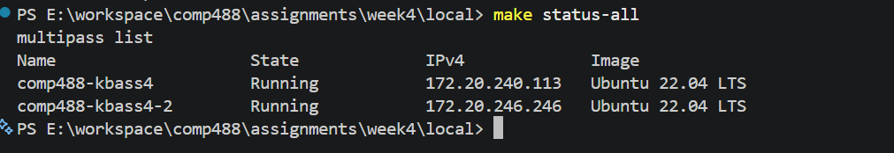
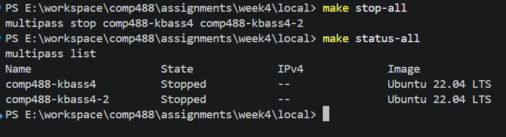

# Week 4

## W4.1 Local Virtual Machine Management with Multipass

### Overview

Multipass was selected as the local virtual machine framework. It provides a command-line interface for creating and managing Ubuntu virtual machines locally.

The environment used for this assignment consists of:

- **Host OS:** Windows
- **Virtualization backend:** Hyper-V
- **VM framework:** Multipass
- **Guest OS:** Ubuntu 22.04 LTS
- **Primary VM:** `comp488-kbass4`
- **CPU:** 2 vCPUs
- **Memory:** 2 GB
- **Disk:** 10 GB

---

### Multipass Installation and Configuration

Multipass was installed using Windows Package Manager:

```powershell
winget install -e --id Canonical.Multipass
```

The installation was verified with:

```powershell
multipass version
```

The installed version was:

```text
multipass   1.16.4+win
multipassd  1.16.4+win
```

Hyper-V was configured as the virtualization backend:

```powershell
multipass get local.driver
```

Output:

```text
hyperv
```

The Windows Virtual Machine Platform feature was enabled with:

```powershell
dism.exe /online /enable-feature /featurename:VirtualMachinePlatform /all /norestart
```

This allowed Multipass to successfully launch virtual machines using Hyper-V.

---

### Makefile Setup

The Makefile was created at:

```text
assignments/week4/local/Makefile
```

The VM configuration is defined using variables:

```makefile
VM_NAME = comp488-kbass4
VM2_NAME = comp488-kbass4-2
IMAGE = 22.04
CPUS = 2
MEMORY = 2G
DISK = 10G
```

The primary VM can be managed using the following targets:

- `make create`
- `make start`
- `make stop`
- `make status`
- `make info`
- `make shell`
- `make delete`
- `make purge`

The VM was created entirely through the Makefile:

```powershell
make create
```

The resulting VM was verified with:

```powershell
make status
make info
```

The resulting configuration was:

```text
Name:       comp488-kbass4
State:      Running
Release:    Ubuntu 22.04.5 LTS
CPU(s):     2
Memory:     approximately 2 GB
Disk:       approximately 10 GB
```

Shell access was tested using:

```powershell
make shell
```

Inside the VM, the operating system was verified with:

```bash
lsb_release -a
```

Output:

```text
Distributor ID: Ubuntu
Description:    Ubuntu 22.04.5 LTS
Release:        22.04
Codename:       jammy
```

---

### VM Lifecycle Management

The Makefile was tested for the complete VM lifecycle.

The VM was stopped using:

```powershell
make stop
```

Its state was verified with:

```powershell
make status
```

The VM was then restarted using:

```powershell
make start
```

Detailed information about the VM can be displayed using:

```powershell
make info
```

The VM can also be deleted and permanently removed using:

```powershell
make delete
make purge
```

During testing, the VM was successfully deleted, purged, and recreated using:

```powershell
make create
```

This demonstrated that the lifecycle of the local virtual machine can be managed entirely through the Makefile.

---

### Managing Multiple Virtual Machines

Multiple virtual machines can also be managed through the same Makefile.

A second VM was defined as:

```makefile
VM2_NAME = comp488-kbass4-2
```

Additional Makefile targets were implemented:

- `make create-second`
- `make start-all`
- `make stop-all`
- `make status-all`
- `make delete-second`

The second VM was created using:

```powershell
make create-second
```

Running:

```powershell
make status-all
```

confirmed that both virtual machines were running:

```text
Name                    State             IPv4             Image
comp488-kbass4          Running           172.20.240.113   Ubuntu 22.04 LTS
comp488-kbass4-2        Running           172.20.246.246   Ubuntu 22.04 LTS
```



Both virtual machines were stopped simultaneously using:

```powershell
make stop-all
```

Running `make status-all` confirmed that both instances were stopped:

```text
Name                    State             IPv4             Image
comp488-kbass4          Stopped           --               Ubuntu 22.04 LTS
comp488-kbass4-2        Stopped           --               Ubuntu 22.04 LTS
```



Both machines were then started simultaneously using:

```powershell
make start-all
```

This demonstrates that multiple Multipass instances can be managed from a single Makefile by assigning unique VM names and defining targets that operate on multiple instances.

After testing, the temporary second VM was removed using:

```powershell
make delete-second
```

The primary VM, `comp488-kbass4`, was retained.


### Conclusion

Multipass was successfully configured with Hyper-V to provide local Ubuntu virtual machines. A Makefile was used to automate the complete lifecycle of a single VM, including creation, startup, shutdown, status inspection, shell access, deletion, and recreation.

The Makefile was also extended and tested with two virtual machines, demonstrating that multiple instances can be controlled simultaneously.