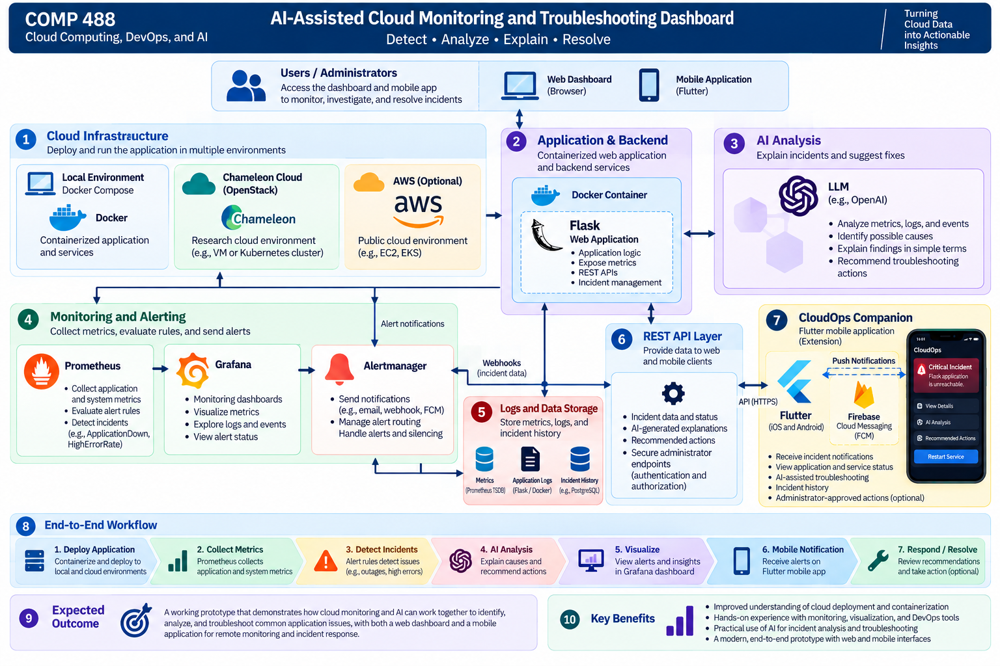

# Project Proposal

## AI-Assisted Cloud Monitoring and Troubleshooting Dashboard

**Student:** Khalidou Bass  
**Course:** COMP 488 – Cloud Computing, DevOps, and AI  
**Instructor:** Gregor von Laszewski  
**Date:** October 2026
**Status:** Approved Project – Proposed Scope Extension

## 1. Project Overview

The goal of this project is to develop an **AI-Assisted Cloud Monitoring and Troubleshooting Dashboard** that monitors a containerized web application, detects common operational issues, and uses artificial intelligence (AI) to explain possible causes and recommend troubleshooting actions.

The project combines cloud computing, DevOps, monitoring, containerization, automation, and AI into a practical system for understanding and responding to application incidents.

As an extension, the project will explore **CloudOps Companion**, a cross-platform mobile application developed using Flutter. This application will allow administrators to receive incident notifications, monitor application health, and access AI-assisted troubleshooting recommendations remotely.

The primary objective remains to build a reliable end-to-end cloud monitoring and troubleshooting prototype.

## 2. Proposed System

The system will follow this workflow:

1. **Application Deployment:** Deploy a containerized Python/Flask web application locally and to selected cloud environments.
2. **Monitoring and Metrics Collection:** Collect application performance metrics, availability information, and relevant operational data.
3. **Incident Detection:** Detect selected incidents, including application outages, elevated HTTP error rates, and resource-related problems.
4. **AI-Assisted Analysis:** Use an AI component to interpret monitoring information, explain possible causes, and recommend troubleshooting actions.
5. **Web Dashboard:** Visualize application health, monitoring metrics, detected incidents, and troubleshooting information.
6. **Mobile Incident Monitoring:** Extend the system through a Flutter mobile application for remote incident notifications and monitoring.
7. **Administrator-Approved Remediation (Optional):** Explore secure, predefined corrective actions that administrators can explicitly approve.

### Proposed System Architecture

The proposed architecture consists of:

- **Application Layer:** A containerized Flask application exposing health information and monitoring metrics.
- **Monitoring Layer:** Prometheus for metrics collection and alert evaluation.
- **Visualization Layer:** Grafana for monitoring dashboards and performance visualization.
- **AI Analysis Layer:** An AI component for incident explanations and troubleshooting recommendations.
- **Backend API Layer:** Flask-based REST APIs for providing incident information to client applications.
- **Mobile Layer:** CloudOps Companion, a Flutter application for remote monitoring and notifications.
- **Cloud Infrastructure Layer:** Local Docker deployment and selected cloud environments for deployment and evaluation.

The mobile application will communicate with the backend through authenticated APIs rather than accessing infrastructure management interfaces directly.

## 3. Technologies

The project is expected to use:

| Technology | Purpose |
|---|---|
| **Python / Flask** | Web application, backend services, and REST APIs |
| **Docker / Docker Compose** | Containerization and local service orchestration |
| **Chameleon Cloud / OpenStack** | Proposed research-cloud deployment |
| **AWS** | Proposed public-cloud deployment and comparison |
| **Prometheus** | Metrics collection, monitoring, and incident detection |
| **Grafana** | Monitoring dashboards and visualization |
| **LLM / AI Integration** | Incident analysis and troubleshooting recommendations |
| **Flutter / Dart** | Cross-platform mobile companion application |
| **Firebase Cloud Messaging** | Proposed mobile push notification delivery |
| **GitHub / GitHub Actions / Makefile** | Version control, automation, testing, and deployment workflows |

The final cloud deployment environments, AI integration, and mobile notification mechanism will be selected based on project requirements, available resources, and implementation feasibility.

## 4. Project Objectives

The main objectives are to:

1. Develop and containerize a sample web application.
2. Deploy and monitor the application locally and in selected cloud environments.
3. Collect and visualize application health and performance metrics.
4. Detect selected operational incidents using monitoring rules.
5. Integrate AI to explain incidents and recommend troubleshooting actions.
6. Evaluate monitoring behavior and compare selected deployment characteristics.
7. Demonstrate an end-to-end monitoring and troubleshooting workflow.

### Extended Objectives

Subject to available development time:

1. Develop a Flutter mobile companion application.
2. Deliver incident notifications to administrators.
3. Display application health, active alerts, and incident history on mobile devices.
4. Present AI-generated troubleshooting recommendations through the mobile interface.
5. Explore secure, administrator-approved corrective actions for selected incidents.

## 5. Expected Outcomes and Deliverables

The expected outcome is a working prototype demonstrating how cloud monitoring and AI can work together to identify, analyze, and troubleshoot common application issues.

### Core Deliverables

- A functional containerized Flask application.
- Local and selected cloud deployment configurations.
- Prometheus-based metrics collection and alerting.
- Grafana monitoring dashboards.
- Detection and simulation of selected application incidents.
- AI-generated incident explanations and troubleshooting recommendations.
- Basic deployment and monitoring evaluation.
- Source code, documentation, and a final project demonstration.

The primary workflow will be:

**Application → Monitoring → Incident Detection → AI Analysis → Troubleshooting Recommendation**

### Extended Deliverable: CloudOps Companion

The project will explore a Flutter-based mobile prototype with the following capabilities:

- View monitored applications and their operational status.
- Receive notifications when incidents are detected.
- Review incident details and AI-assisted troubleshooting recommendations.
- Access incident history and resolution status.

An advanced demonstration may include an authenticated administrator approving a predefined remediation action, such as restarting a stopped application service.

The mobile application will complement the web dashboard rather than replace it.

## 6. Project Scope

The primary goal is to complete a reliable end-to-end prototype rather than develop a production-scale monitoring platform.

### Core Scope

The implementation will focus on:

- Containerized application deployment.
- Application and system monitoring.
- Monitoring dashboards and visualizations.
- Incident detection and alerting.
- AI-assisted incident explanation.
- Troubleshooting recommendations.
- Basic automation, evaluation, and documentation.

### Extended Scope: CloudOps Companion

Subject to available development time, the Flutter mobile application will focus on:

- Application and service status monitoring.
- Incident notifications.
- AI-generated incident explanations.
- Troubleshooting recommendations.
- Incident history and resolution tracking.

If time permits, the project may demonstrate administrator-approved remediation through a secure backend API.

Any remediation functionality will require authenticated access, explicitly permitted operations, administrator confirmation, and action logging.

AI-generated recommendations will not be executed automatically without appropriate authorization and safeguards.

Advanced features such as comprehensive cloud resource management, autonomous remediation, and production-scale incident orchestration are outside the initial scope.

## 7. Development Timeline

The project will be developed incrementally during the remainder of the semester.

| Phase | Activities |
|---|---|
| **Phase 1: Application Development** | Develop and containerize the Flask application |
| **Phase 2: Monitoring and Visualization** | Integrate Prometheus and Grafana |
| **Phase 3: Incident Detection** | Configure and test monitoring alerts |
| **Phase 4: AI-Assisted Troubleshooting** | Develop incident analysis and recommendation functionality |
| **Phase 5: Cloud Deployment and Evaluation** | Deploy to selected cloud environments and evaluate monitoring behavior |
| **Phase 6: Mobile Extension** | Develop a Flutter prototype for incident notifications and remote monitoring, subject to time |
| **Phase 7: Integration and Demonstration** | Complete testing, documentation, and the final demonstration |

The core monitoring and AI-assisted troubleshooting functionality will take priority. The mobile extension will be developed incrementally without compromising the primary project objectives.

## 8. Conclusion

This project aims to demonstrate how cloud computing, DevOps monitoring, and AI-assisted troubleshooting can be integrated into a practical system for detecting and understanding application incidents.

By combining a containerized application, Prometheus, Grafana, cloud infrastructure, and AI-generated recommendations, the project will provide an end-to-end demonstration of application monitoring and incident response.

The proposed **CloudOps Companion** extension will further explore how administrators can receive notifications and respond to operational issues remotely through a Flutter mobile application.

Together, these components will illustrate a practical approach to improving cloud application visibility, incident understanding, and operational responsiveness.
